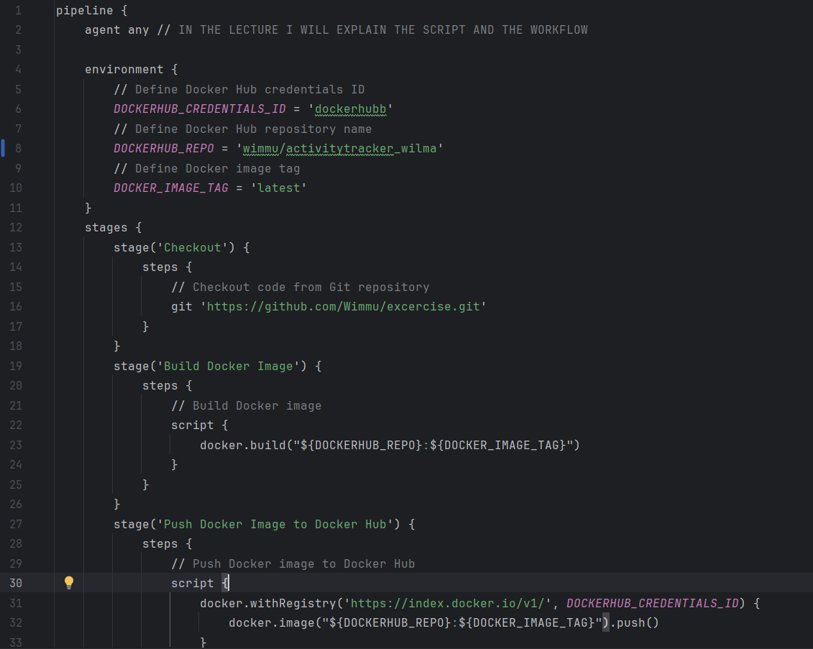
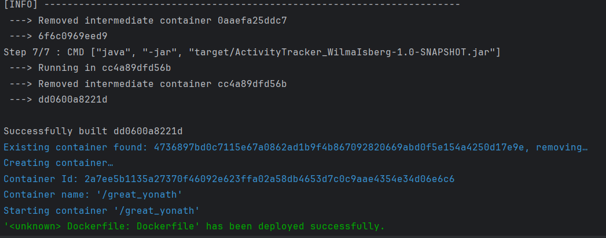
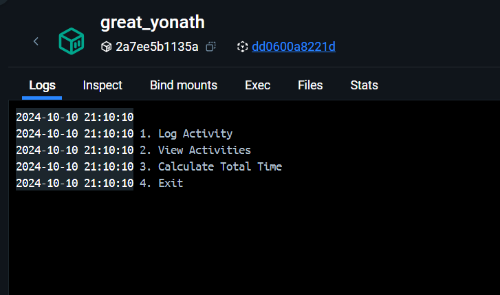

# Sports Activity Tracker

## Report for the project
### Experience
Aloitin projektin kehittämällä yksinkertaisen Java-sovelluksen, jossa käyttäjät voivat kirjata urheilutoimintoja, tarkastella kirjattuja toimintoja ja laskea yhteensä kulutetun ajan viikossa. Sovelluksen kehittämisessä hyödynsin Mavenia projektin rakentamiseen ja testaukseen. Käytin myös JUnitia ja JACOCOa testien suorittamiseen ja kattavuuden tarkistamiseen.
### Challenges
Projektin aikana kohtasin useita haasteita, erityisesti Dockerin ja Jenkinsin kanssa. Vaikka Dockerin avulla pystyin luomaan ja hallitsemaan sovellukseni kontteja, Jenkinsin jatkuvan integraation pipeline-kokoonpanossa oli ongelmia. Esimerkiksi Docker-imagen työntäminen Docker Hubiin epäonnistui, koska en ollut oikein konfiguroinut Dockerin käyttöoikeuksia ja -asetuksia. Koin myös haasteita GitHubin ja Jenkinsin yhdistämisessä, mutta lopulta onnistuin saamaan pipeline toimimaan.

Suurin haasteeni oli kuitenkin virtuaalikoneen käyttöönotto. Yritin asentaa Linux-virtuaalikoneen VirtualBoxilla, mutta en saanut konetta toimimaan. Huomasin, että virtuaalikoneeni ei tunnistanut Dockeria, mikä esti sovelluksen ajamisen Linux-ympäristössä. Yritin useita eri asetuksia ja ratkaisuja ongelman ratkaisemiseksi, mutta en onnistunut.

## Jenkins Pipeline
  <!-- Replace this with your actual image URL -->

## Docker image creation
  <!-- Replace this with your actual image URL -->

## Application in virtual machine
  <!-- Replace this with your actual image URL -->

